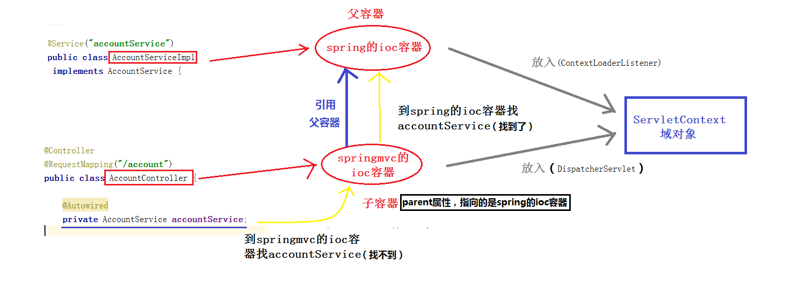

三大框架基本整合说明

web.xml

​	spring配置文件applicationContext.xml通过ContextLoaderListener监听ContextServlet域对象创建时创建springIOC父容器

​	springmvc配置文件springmvc.xml通过DispartherServlet创建springmvcIOC子容器

```
子容器扫描包：
<context:component-scan base-package="com.hxm.controller"/>
		如果子容器包扫描的范围过大，会导致事务失效，原因是springmvc子容器中创建的对象并不是事务所需要的代理对象，就是没有增强事务的对象，这些对象不能控制事务。
父容器扫描包：
<context:component-scan base-package="com.hxm.service.impl"/>
```





